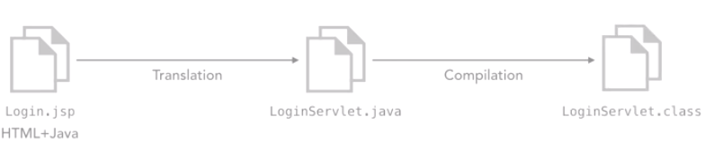
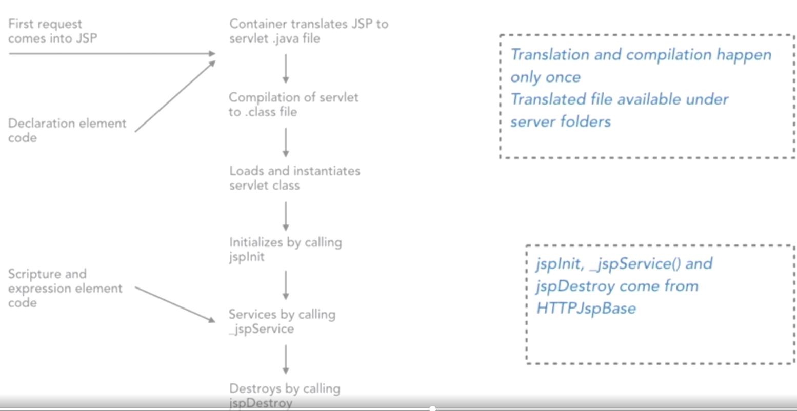
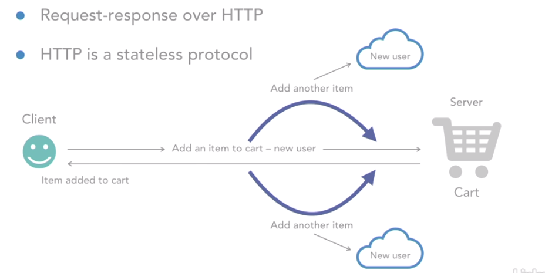
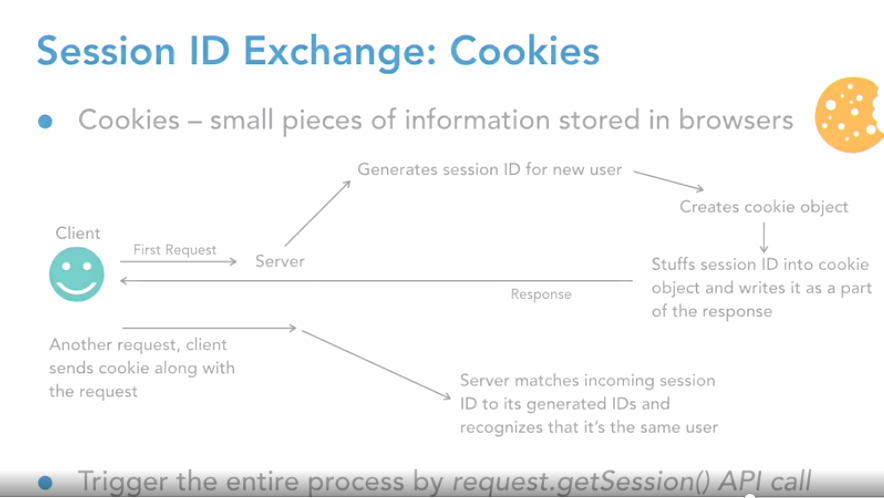
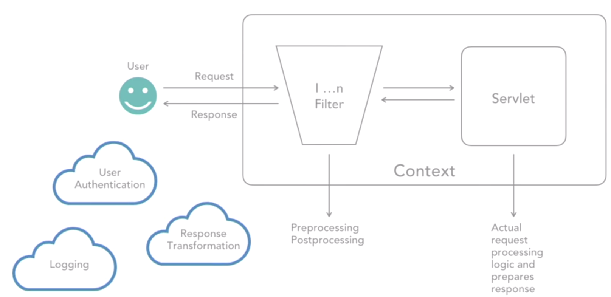
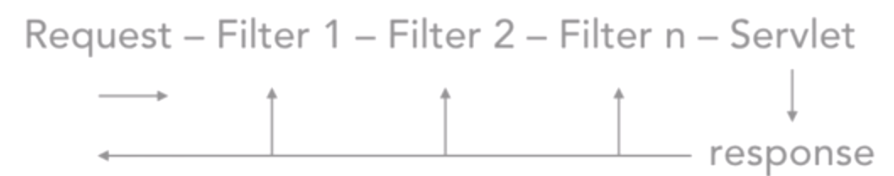

# H+ Sport application
## Implement Model -> View -> Controller(MVC) architecture:
1. View - JSP or HTML files
2. Controller - servlet classes that intercept request and prepare response
3. Model - data access object (DAO) classes that talk to the database

## MySQL as the db
Schema name: Hplus 
tables:
Users - to store all user information
Products - to store all product-related information
Orders - to store order history of a particular user

## Types of HTTP Requests
1. GET - gets information from server
2. POST - processes information on server
3. PUT - uploads a resource on server
4. DELETE - deletes a resource on server
5. HEAD - same as GET, but returns only the headers
6. OPTIONS - helps trace what HTTP methods work on server

## GET Request - get info from server
+ Use to get info form server, can be image, text, video and audio
+ Data sent along is a query string visible in URL; hence, insecure
+ Data limit 8KB, with a few caveats
+ Idempotent(幂等的) - would not change anything on server side if request is sent out multiple times

### Search Use Case: Steps
+ HTML -> Servlet -> DAO -> Database
+ Write a SearchServlet class with the doGet method
+ Collect serach string entered by user and pass to the ApplicationDao class
+ Add method for searching products in ApplicationDao class, which returns all products to calling methods
+ Build the method in SearchServlet, which reads the entire searchResults.html file, read the HTML as a String
+ Assign proper attributes to the form element on HTML

## POST Request - process/post info on server
+ Another HTTP request type
+ Used to post/process information
+ Typically used to modify data into a data store
+ For example, register on a website or checking out a shopping cart
+ Request data is sent in a separate, secure component 
+ POST Request is nonidempotent

### POST case: Register User
+ An action on JSP/HTML -> Servlet -> Dao -> Database
+ Write RegisterUserServlet class with the doPost method, collect all form data and pass to the DAO layer
+ Write a method in ApplicationDao to insert user data
+ Construct and send an information message back to browser from RegisterUserServlet
+ Write message back to the client
+ Assign proper attributes to the form element on HTML

## Forwarding in Servlets

- Clients display the html to user
- Servlet processes the request from client and send to DAO.
- DAO talks to database.
- DAO get the result from db and send back to servlet.
- Servlet writes response to the client.
- When a request reach at one Servlet, because the funcionality is crossing  different Servlet, then after the Servlet does what it is supposed to do, then it will go to other servlet to get the answer. 
- In other cases, a servlet can also forward the entire request to a JSP.

### RequestDispatcher API
- Get RequestDispatcher API on HTTPServletRequest API
- RequestDispatcher.forward to hand over request control to another resource
- RequestDispatcher.include to include response of current and included resource

### ServletConfig API
- Each servlet has its own ServletConfig instance

### ServletContext API
- Used to pass configuration information for the entire application
- Init parameters defined in the deployment descriptor file under the <context-param> element
- Parameters are key-value pairs and always of type String
- One ServletContext instance per application
### HTTPServletRequest Object
- Extends the ServletRequest API and provides all request information to HTTP servlets
- Contains headers and data
- Important API calls: 
`request.getSession`, `request.getHeader(String headerName)`
`request.getRequestURI()`, `request.getParameter(String param)`
`request.getCookies()`, `request.getMethod()`
### HTTPServletResponse Object
- Extends the ServletResponse API and represents the response to client
- Contains headers and data
- Important API calls
`response.sendRedirect(String url)`,`response.addCookie(Cookie cookie)`,
`response.encodeURL(String url)`, `response.setContentType(String contentType)`,
`response.getStatus()`, `response.getWriter()`
The response Object, like the request object, it also has headers and body. 
Body is exactly the place where all the response that have written out from teh servlet sits in,
whereas the headers contain the extra info, like the content type, etc.

## Scopes in a Web App
- Components talk to each other by sharing information
- Information stored in scope object in the form
- Four scopes
1. Request - HTTPServletRequest or ServletRequest
This scope is alive until the response of this request goes back to the client. So information can be store in this request scope in the form of an atrribute, and the information of the attribute is a key-value pair.
2. Session - HTTPSession
3. Context(application) - ServletContext
4. Page - JSPContext

### Parameters vs Attributes
| Parameters                   | Attributes                 |
|------------------------------|----------------------------|
| Return only String values    | Returns objects            |
| Cannot be set in scopes      | can be set in scopes       |
| getParameter("name")         | getAttribute("name")       |
| can be configured in web.xml | setAttribute("name", name) |

### Servlet Life Cycle

- Init method only can be called once. Usually used for db connection.
- Service method is to delegate the call to doGet or doPost methods
- Destroy method is to clean up activity, when shut down the server.

When multiple requests comming for the same servlet, the steps in red color will be happend again for the repeated requests.

Servlet requests come in the application are multithreaded and run in parallel for the concurrent requests.

init method can be override, destory method can be override,
But service method must not be override.

In practical project, db connection uses connection pool to make user make connections to the db.

# JavaServer Pages(JSP)
- Problems with HTML pages
    + Allows to render static data only
    + I/O operation to read and write HTML template back is time-consuming process
    + Stuffing all HTML with CSS code directly inside servlet is tedious
    + Specialized UIdevelopers may not be equipped to handle servlet code
## JSP features
- JSP excuted on server side and rendered to client side
- can work with a scripting language

- jsp file = HTML + java translation to .java compilation to loginServlet.class

- Scriptlet: <% %> - helps write Java statements on JSP
- Expression: <%= %> - helps evaluate expressions on JSP
- Declaration: <%! %> - helps declare variables and methods in a page's scripting language; code goes as seperate method in translated servlet file
### JSP Life Cycle

When the second request comes, it will directly call the jspService method.
### JSP Directives
- Special instructions to container for translation process
- They do not appear as output
- Examples: Import class for the code written on JSP, divise error pages for the application(when error happends, show 404 page, include jsp dynamically)
- In page directives`<%@ page%>` , import is the only directive can be used multiple times, other page directives can be used only once.
- Include directives: `<%@include%>` allows inclusion of JSP resource
### Implicit Objects in JSP
- Objects already created on JSP with predefined
    out: helps write output to JSP - JSPWriter
    request: request for the JSP page - HTTPServletRequest
    response: response for the JSP page - HTTPServletResponse
    session: session object for the user logged in - HTTPSession
    config: represents Servlet Config object
    application: represents ServletContext object
    exception: represents exception and can be used on error pages
    pageContext: contains a reference to all implicit objects and can be used to access information of the page
    
## HTTP has limitation
- HTTP is a stateless protocol, it does not remember the user's info when they add things to the shopping cart

### solution
- Store user info in database upon first request - time-consuming process
- EJB session bean implementation
- Servlet specification has HTTPSession API for session tracking
- Server sets up session ID to uniquely track every user's information
- Session ID exchange by cookies or URL rewriting(send request and respond with the same session id)

### Session management using cookies
- Write a servlet class for session management
- Get the HTTPSession objet on the HTTPServletRequest API
- Create a list of products for the user cart and keep adding selected product name to the list
- Set the search results to the request object as an attribute
- Add form element attributes on page
### Session ID exchange: URL Rewriting
- Fallback option in case cookies are disabled
- URL rewritten with the session ID appended at the end 

- Developer to encode all necessary URLs
#### URL Rewriting steps
- Disable cookies in browser
- Set up session in LoginServlet
- Store user information and forward control to home.jsp
- Write ViewProfileServlet and fetch session information to verify
## Filters
- Filter class is reserved for preprocessing and postprocessing of a request
- can dynamically intercept request and response
- promote modularity, reusability and maintainability
- Prossess the power of abruptly terminating the request execution
- Use case : user authentication, logging, encreption and decreption

- `javax.servlet.Filter` interface
- `javax.servlet.FilterConfig` to pass any configuration info to the filter
- `javax.servlet.FilterChain` invokes a chain of filters together with ethe servlet
- doFilter API is the essential call in filter - holds filter logic

### Filter steps
- Login request -> Servlet -> DAO
- Filter will do authentication and block access to certain servlet URLs(orderHistory, getProfileDetails) in case: malicious user access the URL on a different machine, session itself times out ont the same machine.
- Check the session object for a valid username
- Add the validation method in DAO
- Call DAO method from LoginServlet class
Prepare an error message for invalid user and set it in request; display on JSP
- In the filter class
Retrieve the session for sensitive URLs and check for a valid username
