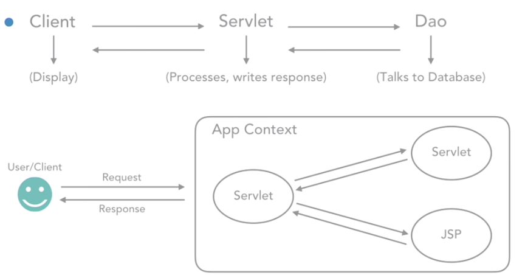

# H+ Sport application
## Implement Model -> View -> Controller(MVC) architecture:
1. View - JSP or HTML files
2. Controller - servlet classes that intercept request and prepare response
3. Model - data access object (DAO) classes that talk to the database

## MySQL as the db
Schema name: Hplus 
tables:
Users - to store all user information
Products - to store all product-related information
Orders - to store order history of a particular user

## Types of HTTP Requests
1. GET - gets information from server
2. POST - processes information on server
3. PUT - uploads a resource on server
4. DELETE - deletes a resource on server
5. HEAD - same as GET, but returns only the headers
6. OPTIONS - helps trace what HTTP methods work on server

## GET Request - get info from server
+ Use to get info form server, can be image, text, video and audio
+ Data sent along is a query string visible in URL; hence, insecure
+ Data limit 8KB, with a few caveats
+ Idempotent(幂等的) - would not change anything on server side if request is sent out multiple times

### Search Use Case: Steps
+ HTML -> Servlet -> DAO -> Database
+ Write a SearchServlet class with the doGet method
+ Collect serach string entered by user and pass to the ApplicationDao class
+ Add method for searching products in ApplicationDao class, which returns all products to calling methods
+ Build the method in SearchServlet, which reads the entire searchResults.html file, read the HTML as a String
+ Assign proper attributes to the form element on HTML

## POST Request - process/post info on server
+ Another HTTP request type
+ Used to post/process information
+ Typically used to modify data into a data store
+ For example, register on a website or checking out a shopping cart
+ Request data is sent in a separate, secure component 
+ POST Request is nonidempotent

### POST case: Register User
+ An action on JSP/HTML -> Servlet -> Dao -> Database
+ Write RegisterUserServlet class with the doPost method, collect all form data and pass to the DAO layer
+ Write a method in ApplicationDao to insert user data
+ Construct and send an information message back to browser from RegisterUserServlet
+ Write message back to the client
+ Assign proper attributes to the form element on HTML

### Forwarding in Servlets

- Clients display the html to user
- Servlet processes the request from client and send to DAO.
- DAO talks to database.
- DAO get the result from db and send back to servlet.
- Servlet writes response to the client.
- When a request reach at one Servlet, because the funcionality is crossing  different Servlet, then after the Servlet does what it is supposed to do, then it will go to other servlet to get the answer. 
- In other cases, a servlet can also forward the entire request to a JSP.